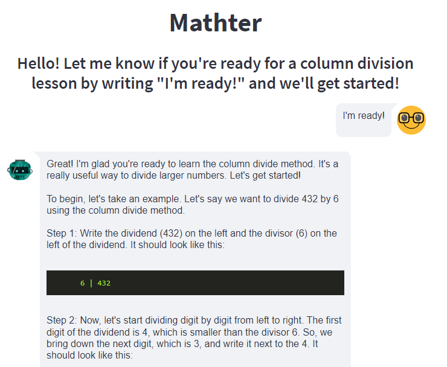
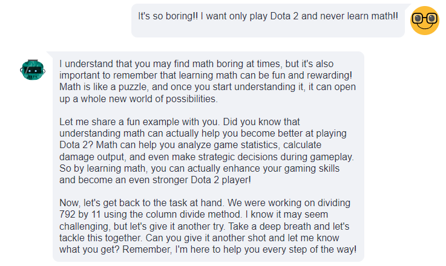
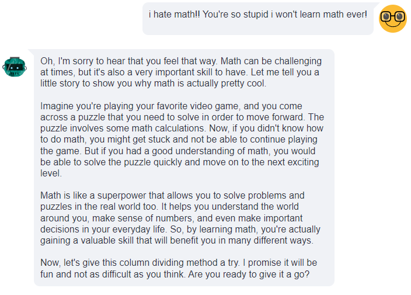

# teacherBot

This is project, that implements idea of individual math assistant for kid.

The main goal of this project is teach 4th grade kid column division method.

OpenAI LLM combined with Langchain is at the heart of Streamlit's typical chat interface.

### Notation of implementation

There was an idea to introduce a record of the child's interaction time so that the chat could motivate them to continue learning.
However, for this to work, the webpage must run continuously, not in streaming way.

Therefore, I have implemented the functionality for such tasks and leave it in the code so that you can look at it or build something of your own.

 ### User manual

You must copy this repo in local machine, create a .env file with openAI key and write it like this.
```bash
OPENAI_API_KEY=sk-...
```

After that fun in project folder this command
```bash
pip install -r requirements.txt
streamlit run App.py
```
----
### Results

Bot is pretty well teaching and answer questions with visualisation of dividing process.
But sometimes it have troubles with formatting "code" of calculation.



Also, it detects if student go bananas and trying not to learn



Of course some casual moderation integration implemented too in polite way.



---
### You can see complete example here: [example](examples/Example1.md)

